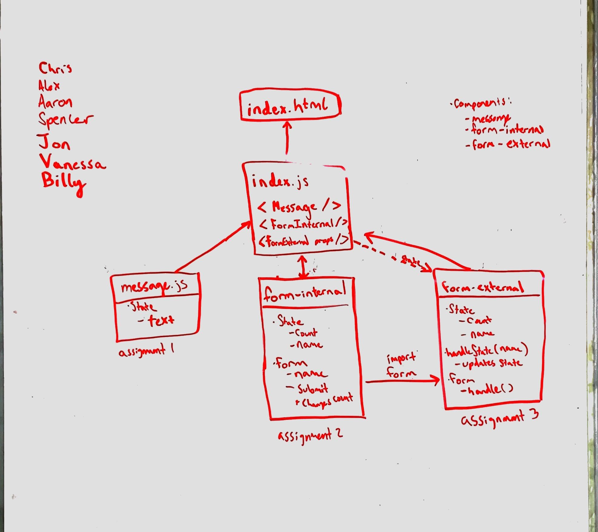

 LAB-28
=================================================

## React State

### Author: Vanessa

### Links and Resources
* [Props part1](https://codesandbox.io/s/v3w7m9xzrl)
* [Props part2](https://codesandbox.io/s/1olzmnpn9q)
* [internal part1](https://codesandbox.io/s/j4w09oqr35)
* [internal part2](https://codesandbox.io/s/72rooy5k76)
* [external part1](https://codesandbox.io/s/3r39w25jxq)
* [external part2](https://codesandbox.io/s/jyl570nz5)

#### Documentation

#### Running the app
* Open links in sandbox

### Components
1. Props:
* message

2. Internal:
* form

3. External:
* form
* output

#### Tests
* How do you run tests?
  * `npm test`

#### UML

